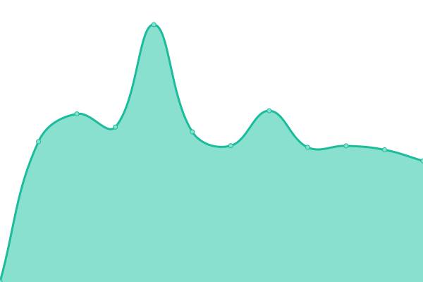
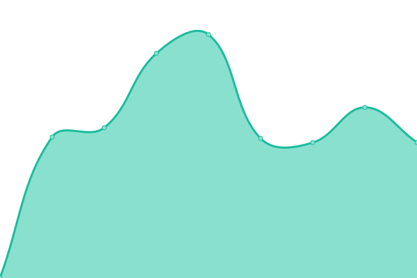

# [📈 Live Status](https://ericwang800.github.io/healthcheck): <!--live status--> **🟧 Partial outage**

This repository contains the open-source uptime monitor and status page for [ericwang800](https://ericwang800.github.io/healthcheck), powered by [Upptime](https://github.com/upptime/upptime).

With [Upptime](https://upptime.js.org), you can get your own unlimited and free uptime monitor and status page, powered entirely by a GitHub repository. We use [Issues](https://github.com/ericwang800/healthcheck/issues) as incident reports, [Actions](https://github.com/ericwang800/healthcheck/actions) as uptime monitors, and [Pages](https://ericwang800.github.io/healthcheck) for the status page.

<!--start: status pages-->
<!-- This summary is generated by Upptime (https://github.com/upptime/upptime) -->
<!-- Do not edit this manually, your changes will be overwritten -->
<!-- prettier-ignore -->
| URL | Status | History | Response Time | Uptime |
| --- | ------ | ------- | ------------- | ------ |
|  [schindler_P](https://main.dm-cn-p.ioee10-cloud.cn/apps/cockpit/index.html#/) | 🟩 Up | [schindler-p.yml](https://github.com/ericwang800/healthcheck/commits/HEAD/history/schindler-p.yml) | 

 1438ms
     
 | 

<a href="https://ericwang800.github.io/healthcheck/history/schindler-p">95.90%</a>
    

|  [schindler-q](https://main.dm-cn-q.ioee10-cloud.cn/apps/devicemanagement/index.html) | 🟥 Down | [schindler-q.yml](https://github.com/ericwang800/healthcheck/commits/HEAD/history/schindler-q.yml) | 

 1592ms
     
 | 

<a href="https://ericwang800.github.io/healthcheck/history/schindler-q">95.91%</a>
    

|  Secret Site | 🟩 Up | [secret-site.yml](https://github.com/ericwang800/healthcheck/commits/HEAD/history/secret-site.yml) | 

 197ms
     
 | 

<a href="https://ericwang800.github.io/healthcheck/history/secret-site">53.39%</a>
    

<!--end: status pages-->

[**Visit our status website →**](https://ericwang800.github.io/healthcheck)

## 📄 License

- Powered by: [Upptime](https://github.com/upptime/upptime)
- Code: [MIT](./LICENSE) © [ericwang800](https://ericwang800.github.io/healthcheck)
- Data in the `./history` directory: [Open Database License](https://opendatacommons.org/licenses/odbl/1-0/)
